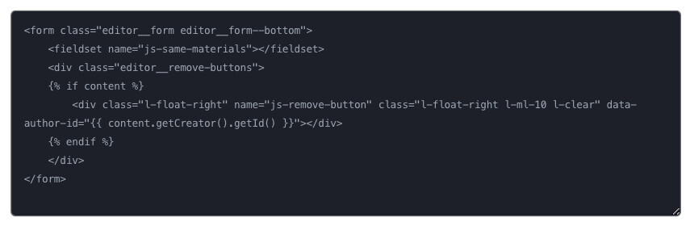

# Raw HTML Tool for Editor.js

Raw Tool for the [Editor.js](https://codex.so/editor) allows to include raw HTML code in your articles.



## Installation

Get the package

```shell
yarn add @editorjs/raw
```

Include module at your application

```javascript
import RawTool from '@editorjs/raw';
```

Optionally, you can load this tool from CDN [JsDelivr CDN](https://cdn.jsdelivr.net/npm/@editorjs/raw@latest)

## Usage

Add a new Tool to the `tools` property of the CodeX Editor initial config.

```javascript
var editor = CodexEditor({
  ...

  tools: {
    ...
    raw: RawTool,
  }

  ...
});
```

## Config Params

| Field       | Type     | Description                   |
| ----------- | -------- | ------------------------------|
| placeholder | `string` | Raw Tool's placeholder string |

## Output data

This Tool returns raw HTML code.

```json
{
    "type" : "raw",
    "data" : {
        "html": "<div style=\"background: #000; color: #fff; font-size: 30px; padding: 50px;\">Any HTML code</div>",
    }
}
```

